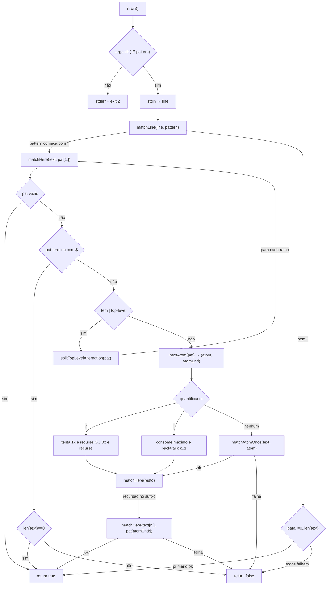

# Mini Grep em Go

Este projeto é uma implementação **didática** de um motor de expressões regulares (regex) em Go.  
Ele imita um `grep` simplificado, aceitando a flag `-E` (extended regex) e padrões básicos como:

- Âncoras: `^` (início), `$` (fim)
- Conjuntos: `[abc]`, `[a-z]`
- Agrupamento: `( … )`
- Quantificadores: `*`, `+`, `?`
- Alternância: `|` (ex: `(cat|dog)`)

---

## 🎯 Objetivo

Aprender como um motor de regex funciona por dentro, implementando manualmente:

1. **Leitura de stdin** → o programa recebe texto pela entrada padrão.
2. **Parsing do padrão** → divide o regex em pedaços (literais, classes, grupos, quantificadores).
3. **Matching recursivo** → percorre o texto testando se cada parte do padrão casa.
4. **Controle de backtracking** → tentar alternativas (como em `|` ou `*`).

---

## 🚀 Uso

Compile:

```bash
go build -o mygrep main.go
```

Exemplos:

```bash
echo -n "cat" | ./mygrep -E "(cat|dog)"   # exit 0
echo -n "dog" | ./mygrep -E "(cat|dog)"   # exit 0
echo -n "apple" | ./mygrep -E "(cat|dog)" # exit 1
```

---

## 🛠 Como funciona internamente

- **`main`** → lê argumentos e stdin, chama `matchLine`.
- **`matchLine` / `match`** → inicia a verificação no texto.  
  - Se o padrão começa com `^`, força casar do início.  
  - Caso contrário, tenta em todas as posições.
- **`matchHere`** → parte central: recebe `text` e `pattern` e tenta casar:
  - Divide o padrão em alternativas (`splitTopLevelAlternation`).
  - Trata casos especiais: fim de string `$`, quantificadores, classes, grupos.
- **Quantificadores**:
  - `*` → zero ou mais repetições.
  - `+` → uma ou mais (com proteção contra consumo vazio).
  - `?` → zero ou uma.
- **Grupos `()`** → extraem o conteúdo e chamam recursivamente `matchHere`.
- **Alternância `|`** → testa cada opção separadamente.

---

## 📚 Manual rápido do grep

O `grep` tradicional busca padrões em arquivos ou stdin usando regex.

### Modos de uso

```bash
grep PATTERN arquivo.txt
grep -E 'exp' arquivo.txt   # regex estendida
grep -i 'abc' arquivo.txt   # ignore case
grep -v 'foo' arquivo.txt   # inverte (linhas que NÃO casam)
```

### Principais metacaracteres

- `.` → qualquer caractere
- `^` → início da linha
- `$` → fim da linha
- `[]` → classe de caracteres
- `|` → ou lógico
- `()` → agrupamento
- `*` → zero ou mais
- `+` → um ou mais
- `?` → zero ou um

### Diferença entre `grep` e `egrep`

- `grep` → regex básicas (precisa escapar `+`, `?`, `|`)
- `egrep` ou `grep -E` → regex estendidas (como neste projeto)

---

## 📦 Estrutura

- `main.go` → contém toda a implementação.
- Entrada → fornecida via `stdin`.
- Saída → exit code (`0` se casar, `1` se não casar, `2` erro).

---

## ✨ Motivação

Este projeto serve como um **laboratório** para entender:

- Parsing de strings
- Recursão e backtracking
- Como ferramentas Unix clássicas (grep, sed, awk) funcionam internamente

---

## 🧭 Diagrama de Fluxo (Mermaid)

> Visão de alto nível do fluxo de matching do mini-grep.


